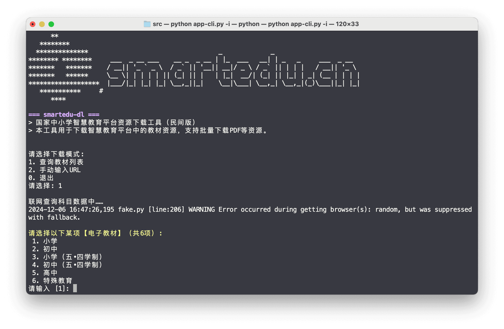
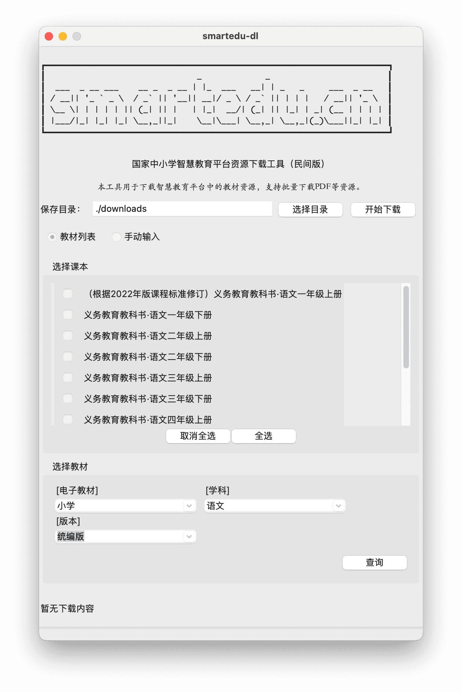
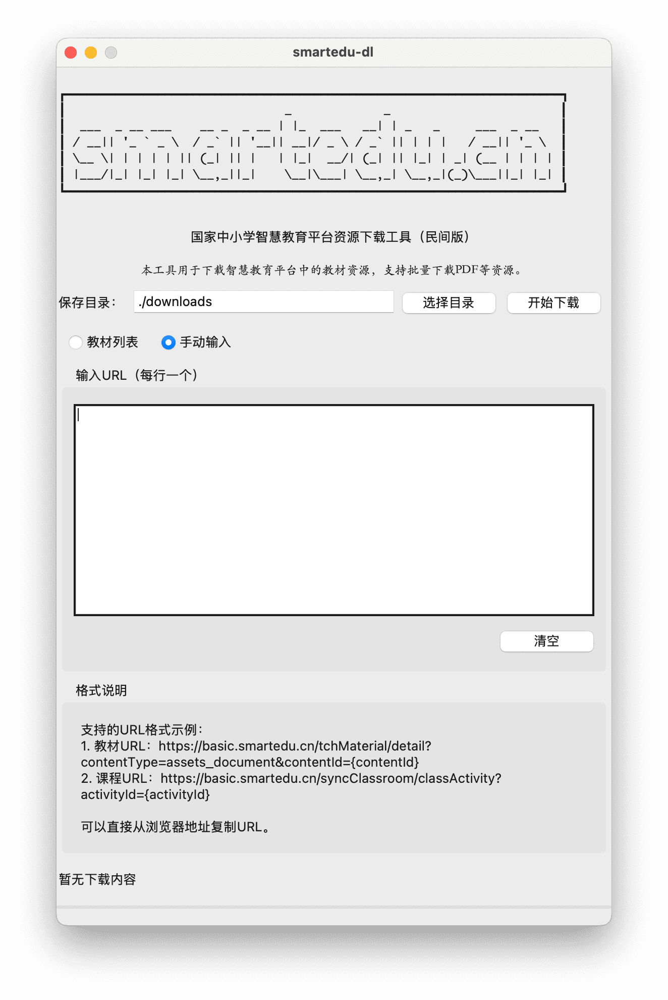

# smartedu-dl

> 智慧教育平台资源下载工具

## 功能说明

主要支持`smartedu.cn`教材、课件（PDF 格式）下载存储。

## 命令行版说明

```shell
Usage: app-cli.py [OPTIONS]

  智慧教育平台资源下载工具

Options:
  -h, --help            帮助信息
  -d, --debug           启用调试模式
  -i, --interactive     交互模式
  -a, --audio           下载音频文件（如果有）
  -u, --urls TEXT       URL路径列表，用逗号分隔
  -f, --list_file PATH  包含URL的文件
  -o, --output PATH     下载文件保存目录
```

用例：

```shell
# 切换目录
cd src/
# 更新依赖
pip install -r requirements.txt 

# 交互模式，进入后选择：
# 1. 查询科目列表：展示电子教材（学业阶段）->学科、版本等
# 2. 手动输入URL：教材或课件详情页的链接，可逗号分隔。
python app-cli.py -i
# SAVEDIR 指定新的默认存储路径
python app-cli.py -i -o $SAVEDIR

# 命令模式: --audio 表示如果有音频也下载
# URL: 链接字符串，逗号分隔多个链接
# FILE: 单个文件名，文件内链接每行一个
python app-cli.py -u $URL --audio
python app-cli.py -u $URL -f $FILE
```



## 图像界面模式

```shell
python app-tk.pyw
```

- 教材列表


- 手动输入


## 依赖

参见: `requirements.txt`文件。其中`click`、`rich`仅在cli版本中使用。

## 相关参考

- [happycola233/tchMaterial-parser](https://github.com/happycola233/tchMaterial-parser)
- [52beijixing/smartedu-download](https://github.com/52beijixing/smartedu-download)
