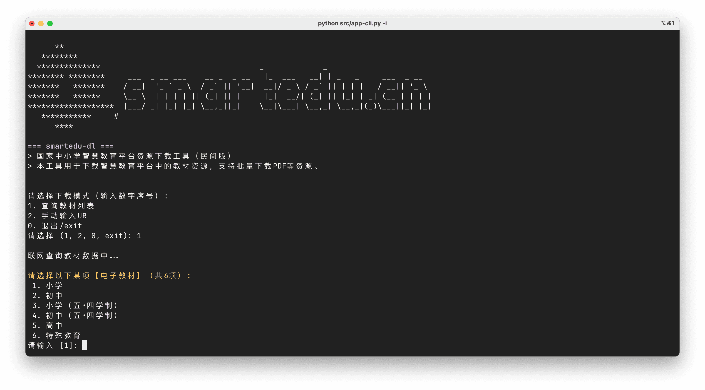
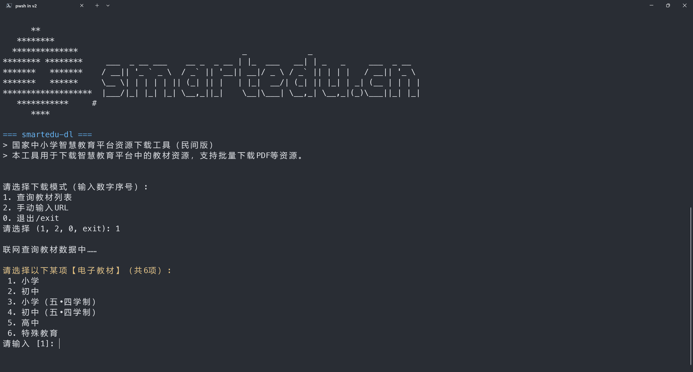
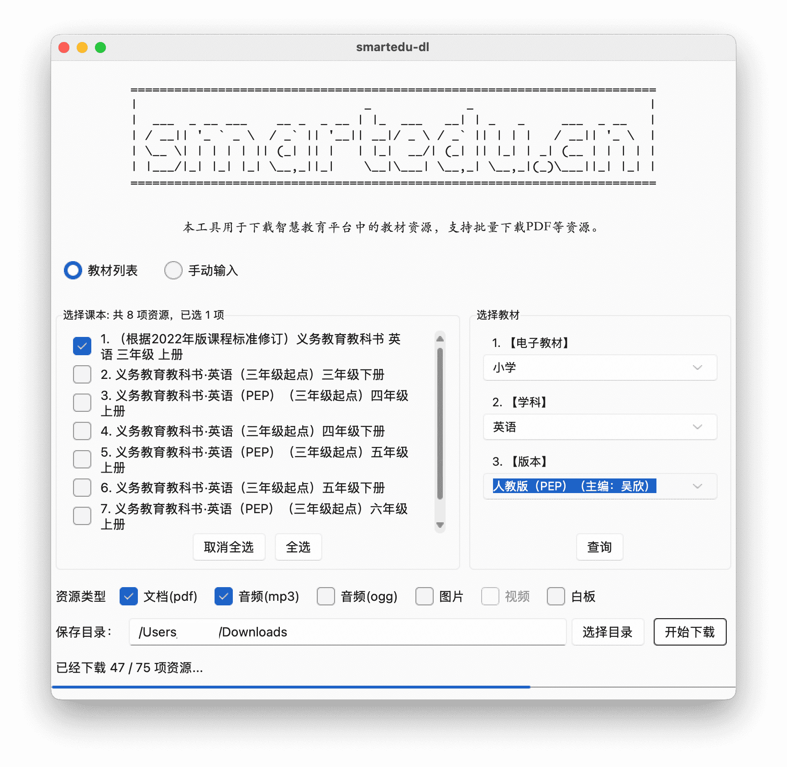
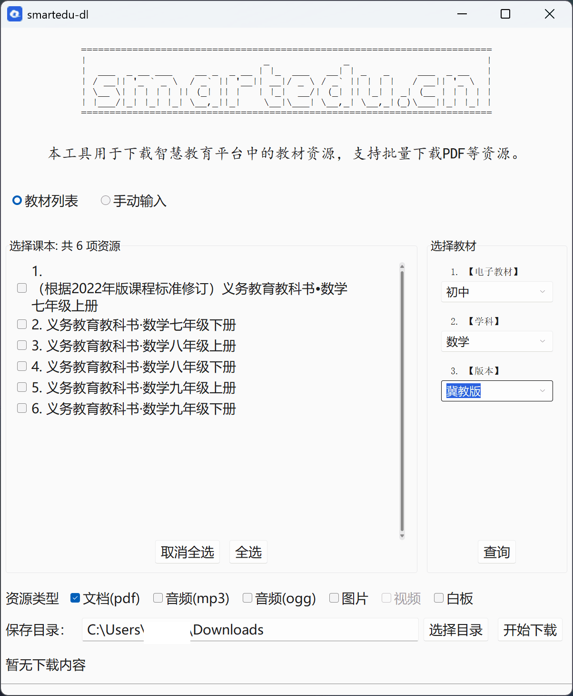
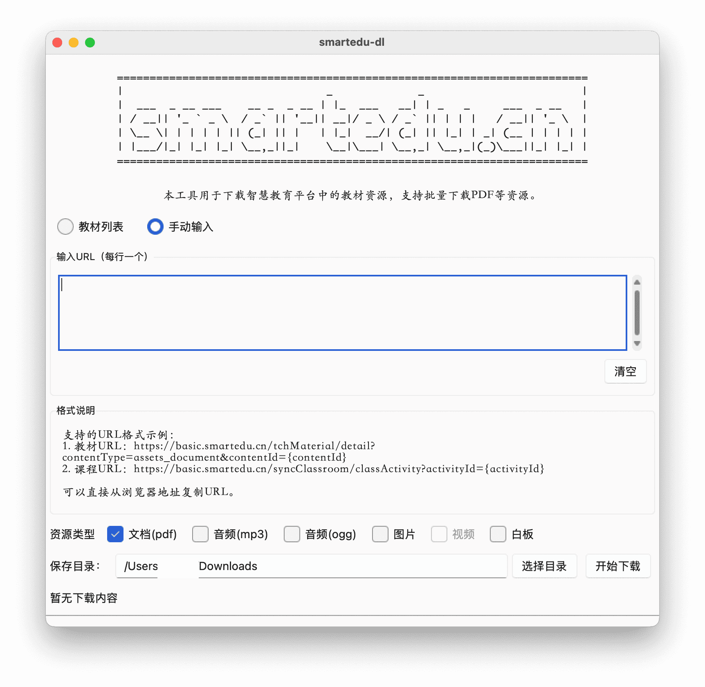
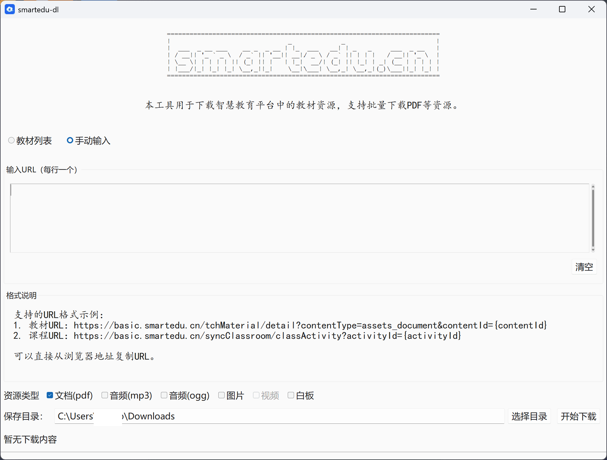

# smartedu-dl


> 智慧教育平台资源下载工具

## 功能说明

主要支持`smartedu.cn`教材、课件（PDF 格式）下载存储。

## 命令行版说明

```shell
Usage: app-cli.py [OPTIONS]

  智慧教育平台资源下载工具

Options:
  -h, --help            帮助信息
  -d, --debug           启用调试模式
  -i, --interactive     交互模式
  -a, --audio           下载音频文件（如果有）
  -u, --urls TEXT       URL路径列表，用逗号分隔
  -f, --list_file PATH  包含URL的文件
  -o, --output PATH     下载文件保存目录
```

用例：

```shell
# 更新依赖
pip install -r requirements.txt

# 切换目录 或者 python src/app-cli.py
cd src/

# 交互模式，进入后选择：
# 1. 查询科目列表：展示电子教材（学业阶段）->学科、版本等；支持输入0回退，输入exit退出。
# 2. 手动输入URL：教材或课件详情页的链接，可逗号分隔。
python app-cli.py
python app-cli.py -i # 交互模式（同上），-i 参数可选。不要和-u/-f连用

# 其他参数：-o 修改默认目录，--formats 提供更多资源类型下载【暂不支持PDF】
python app-cli.py -o $SAVEDIR
python app-cli.py --formats pdf,mp3

# 命令模式:
# URL: 链接字符串，逗号分隔多个链接
# FILE: 单个文件名，文件内链接每行一个
python app-cli.py -u $URL
python app-cli.py -u $URL -f $FILE
```

| macos                            | windows                          |
| -------------------------------- | -------------------------------- |
|  |  |

## 图像界面模式

```shell
# 支持解析下载PDF、音频等格式。
python app-tk.pyw
```

| 界面     | macos                             | windows                            |
| -------- | --------------------------------- | ---------------------------------- |
| 教材列表 |  |  |
| 手动输入 |  |   |

## 依赖

参见: `requirements.txt`文件。

## 相关参考

- [happycola233/tchMaterial-parser](https://github.com/happycola233/tchMaterial-parser)
- [52beijixing/smartedu-download](https://github.com/52beijixing/smartedu-download)
- 图标来自或修改自：<https://www.smartedu.cn/>
